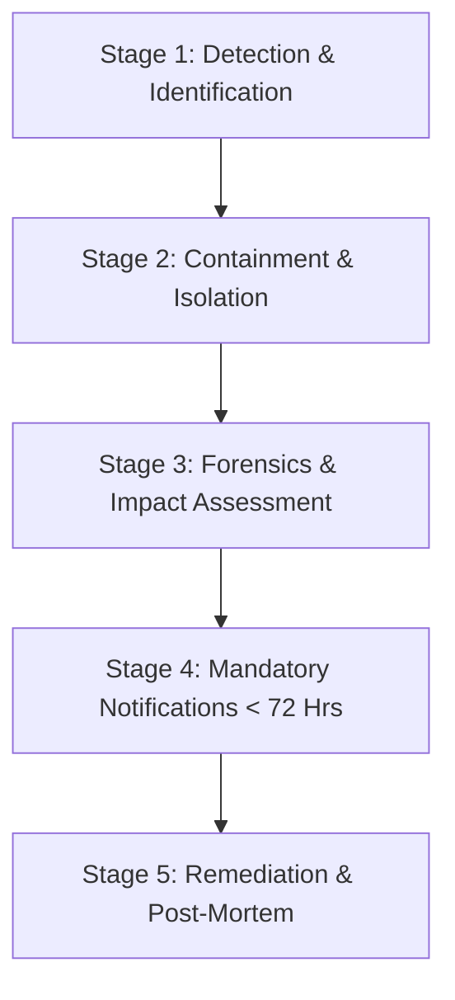

# PropertyOS — Personal Data Breach Incident Response & Notification Runbook

**Document Reference**: DPDP-BREACH-RESPONSE-RUNBOOK-v1.0  
**Regulatory Authority**: Data Protection Board of India (DPBI)  
**Applicable Statute**: Section 8(6) of the Digital Personal Data Protection Act, 2023 (India)  
**Notification Mandate**: Mandatory reporting to DPBI and affected Data Principals without undue delay (within 72 hours of confirmation)  
**Classification**: CONFIDENTIAL & OPERATIONAL  
**Disclaimer**: *LEGAL REVIEW REQUIRED — This operational runbook outlines technical and organizational breach response procedures. Must be reviewed by legal counsel and customized to the specific operating organization.*

---

## 1. Scope and Objective

This runbook defines the end-to-end incident response lifecycle for any suspected or confirmed **Personal Data Breach** occurring within PropertyOS infrastructure, databases, API endpoints, or third-party integrations.

A **Personal Data Breach** is defined under the DPDP Act 2023 as:
> *"Any unauthorized processing of personal data or accidental disclosure, acquisition, sharing, use, alteration, destruction of or loss of access to personal data, that compromises the confidentiality, integrity or availability of personal data."*

---

## 2. Breach Response Team & RACI Matrix

| Role | Responsibility | Designation / Contact |
| :--- | :--- | :--- |
| **Incident Commander (IC)** | Directs technical containment, triage, and root-cause analysis | Lead Architect / Senior DevOps Engineer |
| **Data Protection Officer / Grievance Officer (DPO)** | Assesses regulatory notification thresholds, logs incident, coordinates DPBI filings | Privacy & Legal Compliance Lead |
| **Communications Lead** | Prepares notices to affected Data Principals and external stakeholders | Operations Director / Executive Management |
| **Forensics / Security Lead** | Inspects immutable audit logs, traces attacker IP/session, verifies hash chains | Lead Security Engineer |

---

## 3. Incident Severity Classification

| Severity Level | Criteria | Response Time | Mandatory Escalation |
| :--- | :--- | :--- | :--- |
| **SEV-1 (CRITICAL)** | Unauthorized mass exfiltration of KYC documents, unmasked Govt IDs, passwords, or financial payment details affecting multiple tenants/properties. | **Immediate (< 1 Hour)** | Notify Board, DPO, Legal, and initiate DPBI 72-hour filing protocol. |
| **SEV-2 (HIGH)** | Unauthorized access to isolated tenant records, accidental transmission of tenant profile to incorrect recipient, or unauthorized staff privilege escalation. | **< 4 Hours** | Notify DPO, contain immediately, assess individual Data Principal impact. |
| **SEV-3 (MEDIUM)** | Temporary loss of audit trail availability, unsuccessful brute-force attacks against staff credentials, or misconfigured non-PII log exports. | **< 12 Hours** | Log incident in Security Register; address underlying vulnerability. |
| **SEV-4 (LOW)** | Minor anomalies, non-sensitive internal error logs, or false positive automated security triggers. | **< 24 Hours** | Standard operational ticket resolution. |

---

## 4. Five-Stage Breach Response Workflow



### Stage 1: Detection & Identification (0 – 2 Hours)
1. **Trigger Sources**:
   - Anomaly alerts from Audit Trail (`/api/v1/audit/logs` with `AUTH_FAILED` spikes).
   - Staff or tenant reported unauthorized data visibility.
   - Cloud security anomaly detection or database replication alerts.
2. **Immediate Action**:
   - Declare a Security Incident in internal monitoring.
   - Assign Incident Commander and record incident timestamp.

### Stage 2: Containment & Isolation (2 – 6 Hours)
1. **Revoke Compromised Credentials**:
   - Invalidate active JWT sessions for affected user accounts immediately.
   - Force organization-wide password resets if staff credentials are breached.
2. **Isolate Compromised Systems**:
   - Block malicious IP addresses at the web application firewall (WAF) / reverse proxy.
   - Place affected microservices in read-only or restricted maintenance mode.
3. **Preserve Digital Evidence**:
   - Create cryptographic snapshots of application logs, database state, and `/api/v1/audit` append-only logs.
   - **Do NOT** delete or overwrite log files.

### Stage 3: Forensics & Impact Assessment (6 – 24 Hours)
1. **Query Immutable Audit Logs**:
   - Search for affected `tenantId`, `organizationId`, and resource URIs during the breach window.
   - Determine exact records accessed, exported, modified, or deleted.
2. **Classify Affected Data Categories**:
   - Determine if KYC identity documents (Aadhaar, Passport, PAN), phone numbers, or bank accounts were accessed.
3. **Count Affected Data Principals**:
   - Compile accurate count of distinct individuals impacted.

### Stage 4: Mandatory Regulatory & Principal Notifications (< 72 Hours)
Under Section 8(6) of the DPDP Act 2023, the Data Fiduciary must notify:
1. **The Data Protection Board of India (DPBI)**:
   - Nature and extent of personal data breach.
   - Date and time of incident and detection.
   - Number of Data Principals affected.
   - Likelihood and severity of consequences.
   - Technical containment and remediation measures deployed.
   - Contact information of the designated Grievance Officer.
2. **Affected Data Principals (Tenants / Staff)**:
   - Plain-language description of what occurred.
   - Types of personal data involved.
   - Potential risks (e.g., identity theft, phishing).
   - Immediate protective steps recommended (e.g., monitoring bank statements).
   - Dedicated helpline and Grievance Officer contact details.

### Stage 5: Remediation & Post-Mortem (Days 4 – 14)
1. Patch the root vulnerability.
2. Perform comprehensive code audit and regression testing.
3. Publish internal Post-Mortem Report with corrective prevention measures.
4. Submit final closure report to the Data Protection Board of India.

---

## 5. Official Notification Templates

### Template A: Notice to Data Protection Board of India (DPBI)
```text
To: The Data Protection Board of India
Subject: Incident Notification under Section 8(6) of DPDP Act 2023 — [Organization Name]

1. Data Fiduciary Details:
   - Name: [Organization Name]
   - Registration: [Entity Reg No / CIN]
   - Designated Grievance Officer: [Name, Email, Phone]

2. Breach Particulars:
   - Incident Reference: [INC-YYYY-XXXX]
   - Occurrence Timestamp: [ISO-8601 Timestamp]
   - Detection Timestamp: [ISO-8601 Timestamp]
   - Incident Vector: [e.g., Unauthorized API Access / Credential Compromise]

3. Affected Personal Data:
   - Data Categories: [e.g., Tenant Names, Phone Numbers, KYC Document Identifiers]
   - Number of Affected Data Principals: [Exact Count]

4. Mitigation & Containment Actions:
   - Immediate session revocation executed at [Timestamp].
   - Vulnerability patched and verified in build [Commit Hash].
   - All affected Data Principals notified on [Date].

Submitted by: [Name, Title, Signature]
Date: [Date]
```

### Template B: Notice to Affected Data Principals (Tenants / Occupants)
```text
Subject: Important Security Notice Regarding Your Personal Information — [Property Name]

Dear [Resident Name],

We are writing to inform you of a data security incident that occurred on [Date], which may have involved some of your personal information managed by [Property Name / Operator].

What Happened:
On [Detection Date], our security monitoring detected unauthorized access to [Brief Description]. Our team took immediate action to contain the issue within [X hours].

Information Involved:
The affected information included [e.g., Name, Phone Number, Room Number]. No payment card data or banking passwords were involved.

What We Have Done:
- Blocked the unauthorized access point and reinforced authentication controls.
- Conducted full forensic review using our immutable audit logs.
- Formally notified the Data Protection Board of India in accordance with the DPDP Act 2023.

What You Can Do:
We recommend remaining vigilant against unsolicited communications or phishing attempts asking for sensitive passwords or OTPs.

For Questions and Support:
Our designated Grievance Officer is available to assist you:
Email: privacy@[domain] | Phone: [Phone Number] | Portal: /privacy/data-rights

Sincerely,
Property Management Team
```

---

## 6. Testing & Maintenance

- This runbook must be reviewed and tested via simulated tabletop drills at least **semi-annually**.
- All team members with administrative access must be trained on reporting suspected breaches within 15 minutes of detection.
