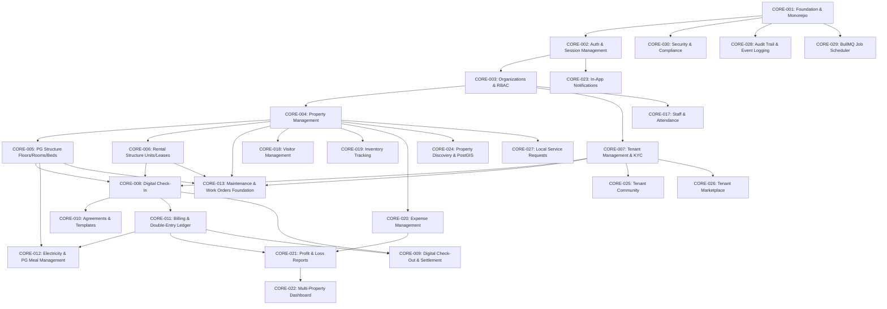

# PropertyOS — Feature Dependencies Graph

This document defines the strict DAG (Directed Acyclic Graph) of module dependencies. Features must be implemented strictly following these dependency tiers.

## Dependency Tiers Summary
1. **Tier 0 (Foundation)**: CORE-001 (Monorepo, Config, Docker, Prisma, Packages), CORE-030 (Security Baseline), CORE-028 (Audit Log Foundation), CORE-029 (Queue Foundation).
2. **Tier 1 (Identity & Multi-Tenancy)**: CORE-002 (Auth), CORE-003 (Orgs & RBAC).
3. **Tier 2 (Core Physical Models)**: CORE-004 (Properties), CORE-005 (PG Hierarchy), CORE-006 (Rental Hierarchy).
4. **Tier 3 (Tenant & Lifecycle)**: CORE-007 (Tenants & KYC), CORE-008 (Check-In), CORE-010 (Agreements), CORE-009 (Check-Out & Settlement).
5. **Tier 4 (Financial & Utilities)**: CORE-011 (Billing & Ledger Foundation), CORE-012 (Electricity & PG Meal Management), CORE-014 (Sub-Metered Electricity Billing & Concurrency Hardening).
6. **Tier 5 (Operations & Facility)**: CORE-013 (Maintenance & Work Order Foundation), CORE-017 (Staff/Attendance), CORE-018 (Visitors), CORE-019 (Inventory), CORE-020 (Expenses).
7. **Tier 6 (Analytics & Dashboards)**: CORE-021 (P&L), CORE-022 (Executive Dashboards).
8. **Tier 7 (Engagement & Ecosystem)**: CORE-023 (Notifications), CORE-024 (Discovery), CORE-025 (Community), CORE-026 (Marketplace), CORE-027 (Services).
