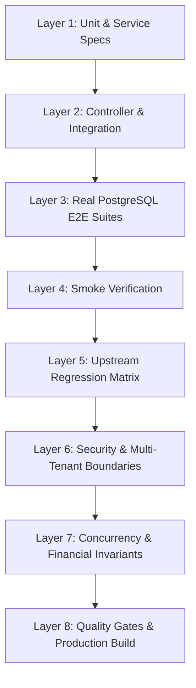

# PropertyOS — Automated Verification & Regression Testing Protocol

This document defines the permanent, non-negotiable automated testing architecture and verification registry for PropertyOS Phase 1 and beyond.

---

## 1. Multi-Layer Testing Architecture

Every milestone implementation must satisfy and automate tests across eight distinct verification layers:

### Layer Details:
1. **Layer 1 (Unit & Service Specs)**: Deterministic business calculation tests, state transition machines, edge cases, Decimal precision, error throwing (`.spec.ts`).
2. **Layer 2 (Controller & Integration)**: Request pipeline, authentication guard, tenant-org scoping, validation pipe, service delegation, envelope wrapping.
3. **Layer 3 (Real PostgreSQL E2E)**: End-to-end execution against live PostgreSQL testing database with row-level transactional verification.
4. **Layer 4 (Smoke Verification)**: Fast-failing verification of system health, route reachability, and critical page rendering.
5. **Layer 5 (Upstream Regression Matrix)**: Mandatory re-execution of all previously completed milestone verification suites to guarantee zero regression.
6. **Layer 6 (Security & Isolation)**: Multi-tenant isolation (cross-organization 404/403), RBAC role-permission checks, property model isolation (`PG` vs `RENTAL_HOUSE`).
7. **Layer 7 (Concurrency & Invariants)**: Double-entry ledger balance ($DR \equiv CR$), non-negative balances, atomic sequence generation, parallel race condition protection.
8. **Layer 8 (Quality Gates)**: `npx prisma validate`, `npx prisma generate`, `npm run typecheck`, `npm run lint`, `npm run build`.

---

## 2. Milestone Verification Registry & Mapping

| Milestone ID | Domain / Feature Area | Permanent Real PostgreSQL E2E Script | Unit Test Suites | Security & Isolation Tests | Current Status |
| :--- | :--- | :--- | :--- | :--- | :--- |
| **CORE-005** | PG Structure (Floors, Rooms, Beds) | `scratch/verify-e2e.js` | `pg-structure.service.spec.ts` | Room capacity, Bed deletion safeguards, PG model guard | **VERIFIED (PASS)** |
| **CORE-006** | Rental Structure (Units & Leases) | `scratch/verify-rental-e2e.js` | `rental.service.spec.ts` | Overlap prevention, Escalation math, Rental model guard | **VERIFIED (PASS)** |
| **CORE-007** | Tenant Lifecycle & KYC | `scratch/verify-tenant-kyc-e2e.js` | `tenants.service.spec.ts` | Multi-tenant isolation, MIME verification, UUID renaming | **VERIFIED (PASS)** |
| **CORE-008** | Digital Onboarding & Check-In | `scratch/verify-checkin-e2e.js` | `checkins.service.spec.ts` | Verified KYC check, Bed occupancy lock, Double-stay rejection | **VERIFIED (PASS)** |
| **CORE-009** | Digital Notice & Check-Out | `scratch/verify-checkout-e2e.js` | `checkouts.service.spec.ts`, `settlement.service.spec.ts` | Refundable math, Release bed inventory, Historical preservation | **VERIFIED (PASS)** |
| **CORE-010** | Digital Agreements & Signatures | `scratch/verify-agreements-e2e.js` | `agreements.service.spec.ts`, `agreement-template.service.spec.ts`, `agreement-renderer.service.spec.ts` | SHA-256 content snapshot, Multi-party signatures, Immutability | **VERIFIED (PASS)** |
| **CORE-011** | Billing, Invoicing & Double-Entry Ledger | `scratch/verify-billing-e2e.js` | `billing.service.spec.ts`, `invoices.service.spec.ts`, `payments.service.spec.ts`, `ledger.service.spec.ts`, `security-deposits.service.spec.ts` | Double-entry $DR \equiv CR$, Over-allocation protection, Idempotent billing cycles | **VERIFIED (PASS)** |
| **CORE-012** | Electricity & PG Meal Management | `scratch/verify-electricity-meals-e2e.js` | `electricity.service.spec.ts`, `meals.service.spec.ts` | Monotonic readings, Reset override, Remainder allocation, Mess matrix `@@unique` | **VERIFIED (PASS)** |
| **CORE-013** | Maintenance & Work Order Management | `scratch/verify-maintenance-e2e.js` | `maintenance.service.spec.ts` | Deterministic lifecycle, PG & Rental targeting, Cost protection, Status history, Vendor CRUD | **VERIFIED (PASS)** |
| **CORE-014** | Sub-Metered Electricity Billing Hardening | `scratch/verify-electricity-hardening-e2e.js` | `electricity.service.spec.ts` (16 tests) | Atomic invoice tx propagation, Advisory locks on charge & rate creation, Reset RBAC, P2002 409 conflict normalization, Rollback test | **VERIFIED (PASS)** |
| **CORE-015** | Meal & Mess Management Concurrency & Hardening | `scratch/verify-meals-hardening-e2e.js` | `meals.service.spec.ts` (20 tests) | Price validation, Meal flags check, Active checkin requirement, Overlap 409 protection, Atomic bulk attendance, Advisory locked charge generation, Single-transaction invoice/ledger propagation ($DR \equiv CR$), Controlled rollback test | **VERIFIED (PASS)** |
| **CORE-016** | Maintenance Ticketing System Hardening | `scratch/verify-maintenance-hardening-e2e.js` | `maintenance.service.spec.ts` (28 tests) | Concurrency advisory locking (`ticket_seq_`, `ticket_transition_`, `vendor_`), Operating model target validation, Non-negative Decimal costs, Tenant role cost sanitization, Kanban & List view | **VERIFIED (PASS)** |
| **CORE-017** | Staff & Attendance Management | `scratch/verify-staff-hardening-e2e.js` (53 assertions) | `staff.service.spec.ts` (24 tests) | Advisory lock phone deduplication (`staff_create_`), Advisory lock attendance serialization (`staff_att_`), Safe deactivation preserving history (`isActive = false`), Non-negative Decimal salary validation, Scoped property & user validation, Multi-tenant fail-closed 404, Decimal payroll aggregation | **VERIFIED (PASS)** |
| **CORE-018** | Visitor & Gatepass Management | `scratch/verify-visitors-hardening-e2e.js` (45 assertions) | `visitors.service.spec.ts` (25 tests) | Advisory lock gatepass code uniqueness (`visitor_gp_`), Advisory lock check-in/out serialization (`visitor_checkin_`, `visitor_checkout_`), Host tenant verification & caller scoping, Chronological exitTime validation, Duplicate check-out 409 rejection, Multi-tenant fail-closed 404, Guard console gatepass lookup | **VERIFIED (PASS)** |
| **CORE-019** | Property & Room Inventory Tracking | `scratch/verify-inventory-hardening-e2e.js` (59 assertions) | `inventory.service.spec.ts` (25 tests) | Advisory lock serial deduplication (`inventory_serial_`), Advisory lock assignment & mutations (`inventory_assign_`), Operating model target validation (PG room vs Rental unit rejection), Status lifecycle transitions, Disposed auto-unassignment, Non-negative Decimal purchase price validation, Multi-tenant fail-closed 404, Decimal asset valuation | **VERIFIED (PASS)** |

---

## 3. Mandatory Development Lifecycle Checklist

Every new CORE milestone must complete this sequence before requesting commit review:

- [x] **1. Dependency Analysis**: Inspect `docs/FEATURE_DEPENDENCIES.md` and identify affected upstream & downstream modules.
- [x] **2. Database Modeling**: Define Prisma models, enums, relations, and unique indexes with decimal precision.
- [x] **3. Backend Service & Controller**: Implement business rules, transactional mutations, and 5-step authorization pipeline.
- [x] **4. Shared Packages**: Add TypeScript interfaces (`packages/types`) and Zod validation schemas (`packages/validation`).
- [x] **5. Frontend UI**: Build responsive, accessible Next.js pages with real API integrations, empty states, and loading indicators.
- [x] **6. Unit Tests**: Implement comprehensive Jest unit tests covering edge cases and calculations (`npm test`).
- [x] **7. Real PostgreSQL E2E Suite**: Create dedicated `scratch/verify-<feature>-e2e.js` covering multi-tenant isolation, concurrency, and state machines.
- [x] **8. Upstream Regression Suite**: Execute all previous milestone E2E test scripts.
- [x] **9. Security & Boundary Verification**: Validate multi-tenant isolation (404 fail-closed) and property type isolation (`PG` vs `RENTAL_HOUSE`).
- [x] **10. Financial & Decimal Invariants**: Confirm `Prisma.Decimal` usage, remainder cent allocation, and double-entry balance.
- [x] **11. Quality Gates**: Execute `npx prisma validate`, `npx prisma generate`, `npm run typecheck`, `npm run lint`, `npm run build`.
- [x] **12. Documentation**: Update `docs/PROJECT_CONTEXT.md`, `docs/FEATURE_REGISTRY.md`, `docs/FEATURE_DEPENDENCIES.md`, `docs/SECURITY.md`, `docs/API.md`, and `docs/TESTING.md`.
- [x] **13. Repository Hygiene Audit**: Review `git status`, verify clean manifest, exclude secrets and temporary artifacts.
- [x] **14. Explicit User Approval**: Present final report and wait for user approval before committing.
